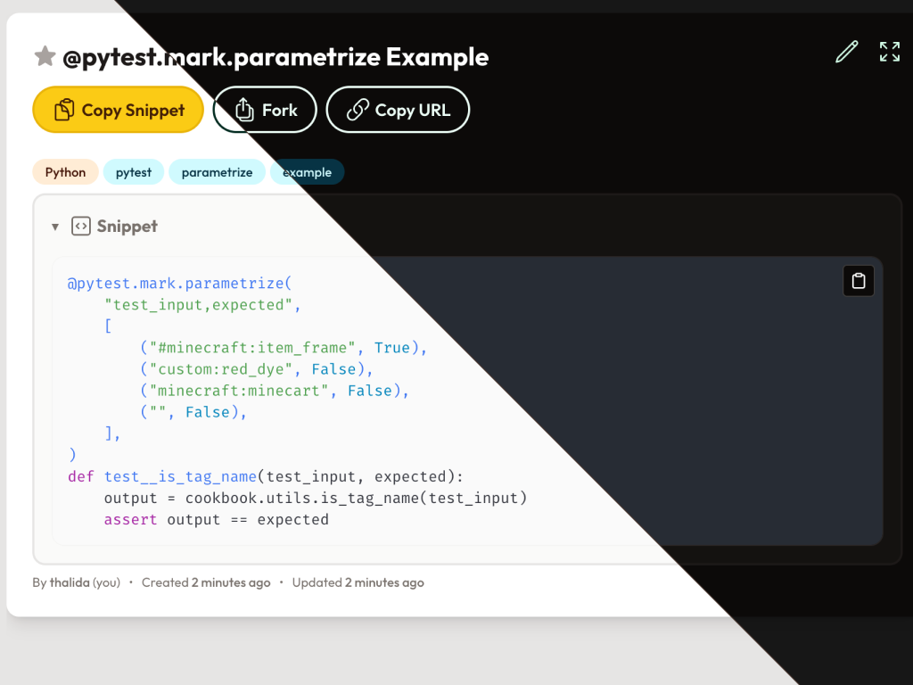

  

    
  

    

        <h2 align="center">An Open Source Snippet Manager</h2>
    

    

        
        
    

  

    

  

## ⚡️ Project Overview

A snippet and script management tool.

Use for free at [devscript.host](https://devscript.host)
or self-host it yourself using the [Quick Start Guide](#-quick-start-guide)

Additional documentation can be found at [docs.devscript.host](https://docs.devscript.host)

---

## 📦 Features

- **SSO Support** - Nine (9) different providers, including a generic option, are supported.
    - _Email/Password registration is also available._
- **CLI Integration** - Run your own snippet on the command line (TODO: link to docs on how to set this up)
- **Advanced search** - Search by title, description, tags, or code content.
- **Tags** - Organize your snippets with tags
- **Discover Snippets** - Explore public snippets shared by other users.
- **Forking** - Fork a snippet to make it your own.
- **Favorites** - Save your favorite snippets for easy access.
- **Syntax highlighting and more** - Code snippets are syntax highlighted for easy reading. Markdown is supported for descriptions.

---

## 🚀 Quick Start Guide

### Running via docker-compose

1. Clone this repository
2. Copy the `.env.example` file to `.env` and fill in the required environment variables
    - **TODO** link to docs configuration page for all env vars and what they do
    - If not using the email server, set `SMTP_LOCAL_DEV=true` to prevent sending emails.
      They will be printed to the console instead.

3. Run `docker compose up` to start the application
4. Access the application at <http://localhost:8000>

---

## 📝 Upcoming features

- Allow disabling registration, and have it be invite only
- Have the email (smtp) server as an optional setup
- VSCode extention to manage snippets directly in the editor
- Autodetect language for code snippets

## 💬 Report a Bug or Feature Request

If you encounter any issues or have suggestions for improvements, file a new issue on our [GitHub issues page](https://github.com/xtream1101/devscript/issues).

If you find a security vulnerability, please do not create an issue. Instead, contact the maintainers directly at [security@devscript.host](mailto:security@devscript.host)

## 🛠️ Development

If you would like to contribute to the project, please refer to the [development guide](https://docs.devscript.host/reference/development/).

## 📜 License

This project is licensed under the [GPLv3](LICENSE).
